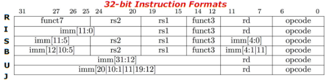

# 汇编指令

## 算术指令
* **In RISC-V Assembly Language:**  
    Registers replace C Variables  
    One instruction (simple operation) per line  
    Simpler is Better, Smaller is Faster
* **In RV32, words are 32b**
* **Instructions: add, addi, sub**
* **Register:**  
    32 registers, reffered to as x0 - x31  
    Zero: x0

寄存器描述：

| Register |   ABI    | Preserved? | Use by convention |
|   ---    |   ---    |     ---    |        ---        |
|    x0    |   zero   |     n/a    | hardwired to 0, ignore writes|
|    x1    |   ra     |     no     | return address for jumps |
|    x2    |   sp     |     yes    | stack pointer |
|    x3    |   gp     |     n/a    | global pointer |
|    x4    |   tp     |     n/a    | thread pointer |
|    x5    |   t0     |     no     | temporary register 0 |
|    x6    |   t1     |     no     | temporary register 1 |
|    x7    |   t2     |     no     | temporary register 2 |
|    x8    | s0 or fp |     yes    | saved register 0 or frame pointer |
|    x9    |   s1     |     yes    | saved register 1 |
|    x10   |   a0     |     no     | return value or function argument 0 |
|    x11   |   a1     |     no     | return value or function argument 1 |
|    x12   |   a2     |     no     | return value or function argument 2 |
|    x13   |   a3     |     no     | return value or function argument 3 |
|    x14   |   a4     |     no     | return value or function argument 4 |
|    x15   |   a5     |     no     | return value or function argument 5 |
|    x16   |   a6     |     no     | return value or function argument 6 |
|    x17   |   a7     |     no     | return value or function argument 7 |
|    x18   |   s2     |     yes    | saved register 2 |
|    x19   |   s3     |     yes    | saved register 3 |
|    x20   |   s4     |     yes    | saved register 4 |
|    x21   |   s5     |     yes    | saved register 5 |
|    x22   |   s6     |     yes    | saved register 6 |
|    x23   |   s7     |     yes    | saved register 7 |
|    x24   |   s8     |     yes    | saved register 8 |
|    x25   |   s9     |     yes    | saved register 9 |
|    x26   |   s10    |     yes    | saved register 10 |
|    x27   |   s11    |     yes    | saved register 11 |
|    x28   |   t3     |     no     | temporary register 3 |
|    x29   |   t4     |     no     | temporary register 4 |
|    x30   |   t5     |     no     | temporary register 5 |
|    x31   |   t6     |     no     | temporary register 6 |
|    pc    |   (none) |     n/a    | program counter |

指令描述：

| Name | Fmt | RV32I Base | Note |
| ---  | --- | --- | --- |
| ADD  |  R  | ADD rd, rs1, rs2 | rd = rs1 + rs2   R: rigid   rd: register destination   rs: register source |
| ADD Immediate | I | ADDI rd, rs1, imm| rd = rs1 + imm |
|SUB Tract| R | SUB rd, rs1, rs2 | rd = rs1 - rs2 |

## 访存指令
* **Memory is `byte`-addressable, but `lw` and `sw` access one `word` at a time**
* **A pointer (used by `lw` and `sw`) is just a memory address, we can add to it or subtract from it(using offset)**
* **New Instructions: `lw`, `sw`, `lb`, `sb`, `lbu`**

指令描述：

| Name | Fmt | RV32I Base | Note |
| ---  | --- | --- | --- |
| Load Byte | I | LB rd, rs1, imm | |
| Load Halfword | I | LH rd, rs1, imm | |
| Load Byte Unsigned | I | LBU rd, rs1, imm | |
| Load Half Unsigned | I | LHU rd, rs1, imm | |
| Load Word | I | LW rd, rs1, imm | |
| Store Byte | S | SB rs1, rs2, imm | |
| Store Halfword | S | SH rs1, rs2, imm | |
| Store Word | S | SW rs1, rs2, imm | |

## 条件判断分支转移指令
* **A decision allows us to decide what to execute at run-time rather than compile-time**
* **C Decisions are made using conditional statements within if, while, do while, for**
* **RISC-V Decision making instructions are the conditional branches**
* **New Instructions: `beq`, `bne`, `blt`, `bltu`, `bge`, `j`**

指令描述：

| Name | Fmt | RV32I Base | Note |
| ---  | --- | --- | --- |
| Branch == | B | BEQ rs1, rs2, imm| BEQ: Branch Equal |
| Branch != | B | BNE rs1, rs2, imm| BNE: Branch Not Equal |
| Branch < | B | BLT rs1, rs2, imm| BLT: Branch Less Than |
| Branch >= | B | BGE rs1, rs2, imm| BGE: Branch Greate Equal |
| Branch < Unsigned | B | BLTU rs1, rs2, imm| |
| Branch >= Unsigned | B | BGEU rs1, rs2, imm| |

## 逻辑运算指令
* **New Instructions: `sll`, `srl`, `slli`, `sra`, `srai`, `and`, `or`, `xor`, `andi`, `ori`, `xori`**

指令描述：

| Name | Fmt | RV32I Base | Note |
| ---  | --- | --- | --- |
| Shift Left Logical | R | SLL rd, rs1, rs2| |
|Shift Left Log. Imm. | I | SLLI rd, rs1, shamt| |
|Shift Right Logical | R | SRL rd, rs1, rs2 | |
|Shift Right Log. Imm. | R | SRLI rd, rs1, rs2 | |
|Shift Right Arithmetic | R | SRA rd, rs1, rs2 | |
|Shift Right Arith. Imm. | I | SRAI rs, rs1, rs2 | |
| XOR | R | XOR rd, rs1, rs2 | |
| XOR Imm. | I | XORI rd, rs1, imm | |
| OR | R | OR rd, rs1, rs2| |
| OR Imm. | I | ORI rd, rs1, imm| |
| AND | R | AND rd, rs1, rs2 | |
| AND Imm. | I | ANDI rd, rs1, imm | |

## 函数调用指令
* **Registers**
    a0-a7 for function arguments, a0-a1 for return values  
    ra return address  
    s0-s11 saved registers  
    zero  
* **Instructions**
    Unconditinal branches(jumps): `j`, `jr`  
    Functions called with `jal`, return with `jr ra`   

指令描述：

| Name | Fmt | RV32I Base | Note |
| ---  | --- | --- | --- |
| Jump and Link| J | JAL rd, imm | |
| Jump & Link Register | I | JALR rd, rs1, imm| |

## 指令格式

其中：
1. `rd`, `rs1`, `rs2` 都占 5 bit，对应 0～31 寄存器
2. 除 U型和 J型指令，其余指令格式中，立即数只占 12bit，对于大立即数的表示，需要用到 U型指令进行高 20bit填充   **注意**：12bit为有符号数，当数值的低12位的符号为1时，将利用 `LUI` 装入的高 20位立即数预先加1，而 `ADDI` 写入的低 12位不变。伪指令 `LI` 用于此种情况，实际会创建两条指令（`LUI` `ADDI`)

## 数据通路（Datapath）
1. Instruction Fetch(IF, 取址)
2. Instruction Decode(ID, 译码)
3. Execute Arithmetic-Logic Unit(EX ALU, 执行)
4. Memory Access (MA, 访存)
5. Write Back to Register(WB, 写回)
