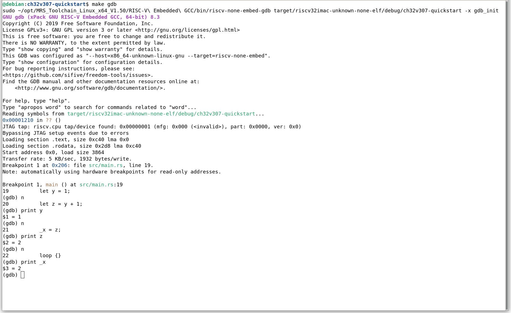

# 工具链及基础工程
## 1. Rust 开发环境
按照官网搭建好基础环境后，需要额外添加一些工具链：
```bash
$ rustup target add riscv32imac-unknown-none-elf
$ cargo install cargo-binutils
$ rustup component add llvm-tools-preview
$ cargo install cargo-generate
```

## 2. CH32V307 的工具链
我个人的开发环境是在linux（debian 11）中作开发， 在 [官网](http://www.mounriver.com/download) 中下载工具链及调试器，因为是用 Rust 作开发，所以没有使用集成开发环境（MR Studio）

## 3. 最简工程
使用现有的 `riscv-rust-quickstart` 项目：
```bash
cargo generate --git https://github.com/riscv-rust/riscv-rust-quickstart
```
该工程是 HiFive1 开发板的模板，需要简单修改：
```rust
// src/main.rs
#![no_std]
#![no_main]

extern crate panic_halt;

// use hifive1::hal::prelude::*;
// use hifive1::hal::DeviceResources;
use riscv_rt::entry;

#[entry]
fn main() -> ! {
    // let dr = DeviceResources::take().unwrap();
    // let p = dr.peripherals;

    // // Configure clocks
    // let _clocks = hifive1::clock::configure(p.PRCI, p.AONCLK, 320.mhz().into());
    let _x;
    let y = 1;
    let z = y + 1;
    _x = z;
    loop {}
}
```
修改 `.cargo/config` 中的 `rustflags`，主要是添加 Flash 布局文件:
```
// .cargo/config
[target.riscv32imac-unknown-none-elf]
runner = "riscv64-unknown-elf-gdb -q -x gdb_init"
rustflags = [
  "-C", "link-arg=-Tmemory.x",
  "-C", "link-arg=-Tlink.x",
]

[build]
target = "riscv32imac-unknown-none-elf"
```
在根目录中新建 `memory.x`:
```
// memory.x
MEMORY
{
    FLASH : ORIGIN = 0x00000000, LENGTH = 256K
    RAM : ORIGIN = 0x20000000, LENGTH = 64K
}
REGION_ALIAS("REGION_TEXT", FLASH);
REGION_ALIAS("REGION_RODATA", FLASH);
REGION_ALIAS("REGION_DATA", RAM);
REGION_ALIAS("REGION_BSS", RAM);
REGION_ALIAS("REGION_HEAP", RAM);
REGION_ALIAS("REGION_STACK", RAM);
```

编译：
```bash
$ cargo build
```
应能得到无错误无警告的编译通过，elf 文件位于 `target/riscv32imac-unknown-none-elf/debug/` 中。

## 4. 下载、调试
开发板自带仿真器，芯片厂家的 WCHLink，可以使用 OpenOCD，但需要是步骤2中的版本。连接开发板：
```bash
$ sudo {PathToOpenOCD}/bin/openocd -f {PathToOpenOCD}/bin/wch-riscv.cfg
...
Info : starting gdb server for riscv.cpu.0 on 3333
Info : Listening on port 3333 for gdb connections
Info : accepting 'gdb' connection on tcp/3333
```
其中 `{PathToOpenOCD}` 是步骤2中的工具链地址。可以看到，默认监听 `3333` 端口，等待 GDB 连接。令开一个终端：
```bash
$ sudo {PathToOpenOCD}/RISC-V\ Embedded\ GCC/bin/riscv-none-embed-gdb {PathToELF}
```
其中 `{PathToELF}` 即步骤3 中的编译输出文件。连接上 OpenOCD GDB服务器后，就是普通的 GDB 调试流程：
```bash
$ target remote 127.0.0.1:3333
$ load
$ b main
$ c
$ n
$ print y
$ n
$ print z
$ n
$ print _x
```
依次可以看到 `y` 为 1，`z` 为 2, `_x` 为 2。



> 建议：
> 1. 将命令部分命令写在 `gdb_init` 文件中，在命令中显式添加 `-x gdb-init` 参数来执行这些命令；
> 2. 将命令写在 `Makefile` 中，方便调用。 

程序运行成功。

## 5. 待续
后续需要完成 VSCode 相关配置，一键完成启动调试、下载，以及可视化调试过程。
